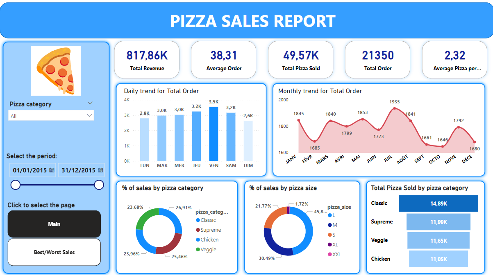
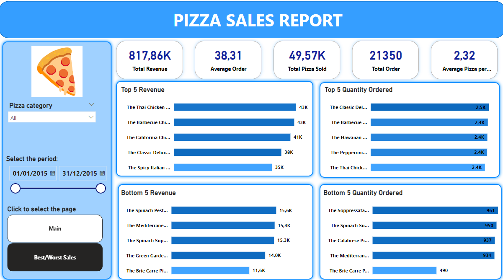

# Pizza Sales Report 

  

---

## Introduction 
Do you like pizza? As for me, I do!  In this data project, I have created a dashboard with Power BI in order to analyse the pizza sales. Having a visualization of the data is pretty relevant in order to answer crucial questions related to the customer preference and carry out improvement. 
One can easily identity the trend by looking at the dashboard.  
**_Disclaimer_**: _all datasets and report do not represent any company, insitution or country, but just a dummy dataset to demonstrate capabilities of Power BI._

This project was inspired from this [Youtube video](https://www.youtube.com/watch?v=V-s8c6jMRN0&t=7149s)

## Problem Statement 
1. What is the daily total sales (revenue) of pizza?
2. What is the the monthly sales (revenue) of pizza?
3. Identity the percentage of the revenue, the quantity ordered and the number of orders for each category of pizza.
4. Which size is the most popular?
5. What are the top 5 best sellers? The bottom 5?

## Skills  /Concepts demonstrated
The following Power BI features were incorporated:  
- DAX
- Filter
- Button
- Slicer
- Page navigation
- Quick measures
- Query Cleaning

## Visualization
The report comprises 2 pages:  
- Daily, monthly revenue and trend per category
- Top 5 and Bottom 5 pizza depending on Revenue, Quantity ordered

**_Interested :)  ? You can interact with the dashborad [here]()_**

The dynamic dashboard above has two slicers. The first enable the user to choose the category of pizza. The second one sets the period one is interest in. There are also two buttons helping the user to navigate the pages. 

Moreover, a bench of buttons make it more straightforward for the user to have an idea about the pizzeria KPIs (Revenue, total order, average pizzas sold, etc.). In addition to this first dashboard, there is a second one summarizing the preference of the customers: Top 5 pizza, as well as Bottom 5, are shown:

## Analysis

As it could be seen from the dashboard, pizza sales are good in Friday and Saturday. Kinda logic, it's week-end time!
Through the year, January and July have the most pizza lovers!  If the pizzeria owner wants some holidays, it's better to close the restaurant in February, no that much sales... 
The most loved pizzas is: Classic Deluxe! And the worst sellers is....the Brie Carre Pizza (needs some improvement)  
Customers tend to order a L-size pizza! 

## Conclusion

I'm convinced that this dashboard could be useful in the real industry. It helps the user to understand what is hidden behind data and make right decisions.  
This is my first project using Power Bi! I did appreciate working with it! It has lead me to discover plenty of features about data visualization. Let's dive into data! This journey will be fabulous ;)

Thank you for reading this report, I'm looking forward to showing you my next project!

Have a good day! 
Best regards, 

Olivia 

